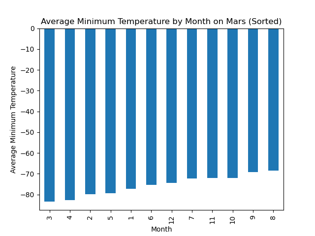
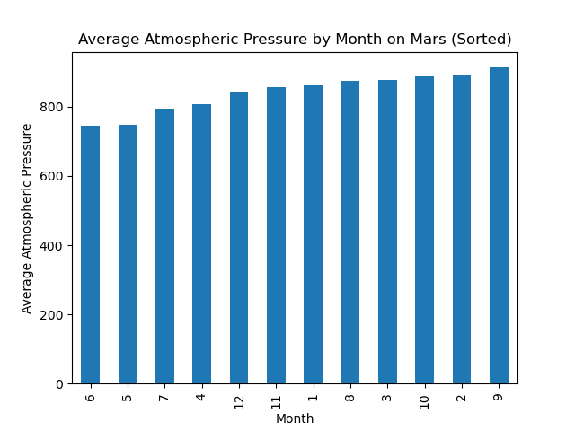
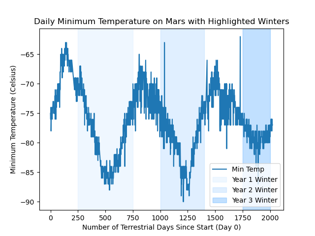

# Module 11 Challenge: HTML Web Scraping

## Overview

This project is part of my **Data Analytics Bootcamp** coursework. It focuses on **web scraping** and **data analysis** to explore data from Mars-related sources. Using tools like **Splinter**, **Beautiful Soup**, and **Pandas**, I collected, organized, and visualized data, building foundational skills for data-driven decision-making.

---

## Contents

- [Project Objectives](#project-objectives)
- [Deliverables](#deliverables)
- [Setup](#setup)
- [Part 1: Mars News Titles and Previews](#part-1-mars-news-titles-and-previews)
- [Part 2: Mars Weather Data Analysis](#part-2-mars-weather-data-analysis)
- [Analysis and Findings](#analysis-and-findings)
- [Project Folder Structure](#project-folder-structure)
- [Skills Used](#skills-used)

---

## Project Objectives

1. **Scrape and Extract Data**:
   - Automate browsing and data extraction from websites using Splinter and Beautiful Soup.
   - Extract titles and preview texts of Mars news articles.
   - Scrape weather data from an HTML table on a Mars temperature webpage.

2. **Organize and Analyze Data**:
   - Store scraped data in Python data structures.
   - Analyze the data to answer questions about Mars weather patterns.

3. **Visualize and Communicate Findings**:
   - Create visualizations to demonstrate insights.
   - Export data to CSV for further use.

---

## Deliverables

### Deliverable 1: Scrape Titles and Previews from Mars News
- **Tool Used**: Jupyter Notebook (`part_1_mars_news.ipynb`)
- **Objective**: Scrape the Mars news website for titles and previews of articles.
- **Output**: Python list of dictionaries.

### Deliverable 2: Scrape and Analyze Mars Weather Data
- **Tool Used**: Jupyter Notebook (`part_2_mars_weather.ipynb`)
- **Objective**: Scrape weather data from the Mars temperature table.
- **Output**: Pandas DataFrame containing Mars weather data, visualizations, and exported CSV and PNG files in the output folder.

---

## Setup

### Prerequisites

Ensure you have the following dependencies installed:

- Python 3.7+
- Jupyter Notebook
- Splinter
- Beautiful Soup
- Pandas
- Matplotlib

### Installation

1. Clone this repository:
   ```bash
   git clone https://github.com/your-username/html_web_scraping_challenge.git
   ```
2. Navigate to the project directory:
   ```bash
   cd html_web_scraping_challenge
   ```
3. Install required libraries individually:
   ```bash
   pip install splinter beautifulsoup4 pandas matplotlib
   ```
4. Open the Jupyter notebooks:
   ```bash
   jupyter notebook
   ```

---

## Part 1: Mars News Titles and Previews

### Workflow

1. **Automate Browsing**:
   - Use Splinter to visit the Mars news site.
   - Inspect and identify HTML elements to scrape.

2. **Scrape Data**:
   - Use Beautiful Soup to extract article titles and preview text.
   - Store the results in a list of dictionaries:
     ```python
     [{'title': 'Title 1', 'preview': 'Preview 1'},
      {'title': 'Title 2', 'preview': 'Preview 2'}]
     ```

3. **Optional**:
   - While the data can optionally be saved to a JSON file, it was not implemented in this project.

---

## Part 2: Mars Weather Data Analysis

### Workflow

1. **Automate Browsing**:
   - Use Splinter to visit the Mars temperature data site.
   - Inspect the page and identify the HTML table elements.

2. **Scrape Data**:
   - Use Beautiful Soup to scrape the HTML table.
   - Convert the scraped data into a Pandas DataFrame.
   - Ensure appropriate column headings:
     - `id`, `terrestrial_date`, `sol`, `ls`, `month`, `min_temp`, `pressure`.

3. **Analyze Data**:
   - Convert data types (e.g., datetime, int, float).

4. **Visualize Data**:
   - Create bar charts for temperature and pressure analyses.
   - Plot minimum daily temperatures to estimate the length of a Martian year.
   - Save all charts as PNG files to the output folder.

5. **Export Results**:
   - Save the DataFrame to a CSV file in the output folder.

---

## Analysis and Findings

### 1. How many months exist on Mars?

The analysis of the Mars dataset from the Rover Environmental Monitoring Station (REMS) confirms the existence of **12 unique months** on Mars. To verify this, I analyzed the `month` column in the dataset using Pandas' `nunique()` method, which calculates the number of unique values. Each month corresponds to a specific range of solar longitude (`ls`), a key indicator of seasonal changes on Mars.

### 2. How many Martian days are recorded in the dataset?

The dataset encompasses **1,986 Martian days (sols)**. This total reflects the number of unique records for the `sol` column, where each sol corresponds to one Martian day. By comparing the number of rows in the dataset with the number of unique sols, it is evident that the dataset represents daily recordings with no overlapping or missing sol entries.

This daily granularity provides a detailed and consistent chronological view of Martian weather over nearly 2,000 sols.

### 3. What are the coldest and warmest months on Mars?

#### Workflow:
- Grouped the data by the `month` column.
- Calculated the average of the `min_temp` column for each month using Pandas' `groupby()` and `mean()` functions.
- Visualized the results through a bar chart.

#### Findings:
- **Coldest Month**: Month 3, with an average minimum temperature of approximately -83.3°C.
- **Warmest Month**: Month 8, with an average minimum temperature of approximately -68.4°C.

The visualization of monthly averages reveals distinct seasonal temperature trends. The coldest temperatures during Month 3 align with the peak of Martian winter, while the warmer temperatures in Month 8 reflect the Martian summer in the southern hemisphere. These patterns provide a clear depiction of Mars' seasonal cycle.



### 4. Which months have the lowest and highest atmospheric pressure on Mars?

#### Workflow:
- Grouped the data by the `month` column.
- Calculated the average atmospheric pressure for each month.
- Plotted a bar chart to visualize the pressure variations.

#### Findings:
- **Lowest Pressure Month**: Month 6, averaging around 734 Pa.
- **Highest Pressure Month**: Month 9, averaging around 911 Pa.

These pressure trends are closely tied to the sublimation and condensation of CO2 at Mars' poles. The low pressure in Month 6 coincides with significant CO2 condensation during winter, while the high pressure in Month 9 reflects CO2 sublimation as temperatures rise. This seasonal exchange of atmospheric CO2 contributes to the dynamic atmospheric behavior observed on Mars.



### 5. How many terrestrial days exist in a Martian year?

#### Workflow:
- Identified the coldest days in terms of Earth date counts for three distinct Martian winters.
- Used a for-loop with conditional logic to locate the record with the lowest temperature during visually defined time ranges, corresponding to different years.
- Calculated the differences in Earth date counts between these coldest points to estimate the Martian year length.
- Averaged the calculated year lengths to derive a final estimate.

#### Findings:
- The estimated length of a Martian year is approximately **677.5 Earth days**, aligning closely with known astronomical data.

This method leveraged a column derived from the terrestrial_date data column called `days_since_start` to pinpoint the coldest Martian days, marking the peak of winter. By measuring the intervals between these points, I accurately calculated the Martian year length while visualizing the seasonal cycle through temperature trends.



---

## Project Folder Structure

```
html_web_scraping_challenge/
├── part_1_mars_news.ipynb     # Notebook for scraping Mars news titles and previews
├── part_2_mars_weather.ipynb  # Notebook for scraping and analyzing Mars weather data
├── output/                    # Folder containing exported results
│   ├── mars_weather.csv       # Exported weather data in CSV format
│   ├── mars_winter_ranges.png # Chart showing highlighted Martian winters
│   ├── mars_daily_min_temp.png # Daily minimum temperature plot
│   ├── mars_average_pressure_by_month.png # Average pressure chart
│   └── mars_average_min_temp_by_month.png # Average temperature chart
├── README.md                  # Project README file
```

---

## Skills Used

- **Web Scraping**: Utilized Splinter and Beautiful Soup to extract and parse HTML data.
- **Data Cleaning and Transformation**: Applied Pandas for data organization and preparation.
- **Data Analysis**: Conducted exploratory analysis to uncover patterns and insights.
- **Data Visualization**: Created informative visualizations using Matplotlib.
- **Problem-Solving**: Designed custom logic to estimate Martian year length and handle missing data.

---
